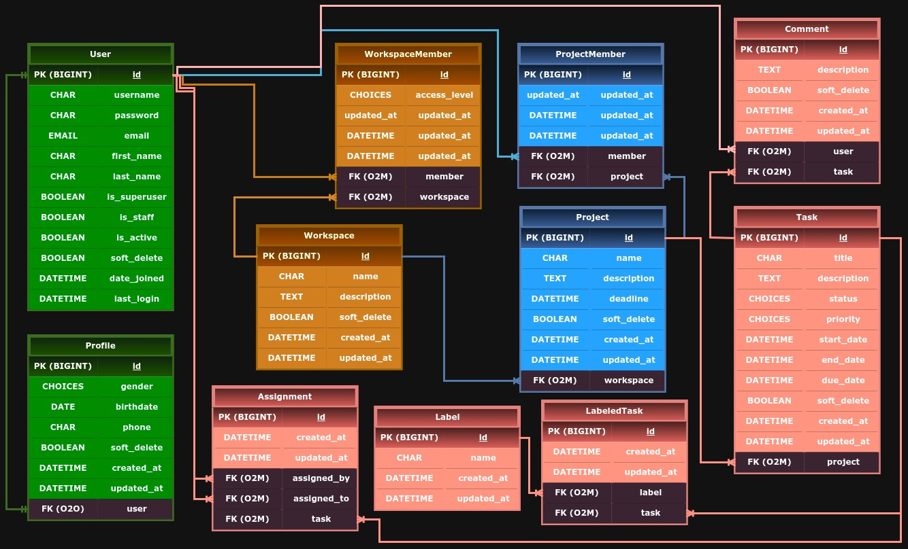

# Trello - Collaborative project management with your team 

A Trello-like collaborative project management web app; **Daneshkar** *Python/Django* bootcamp final project.

***

**How does it works?**
In this app you can easy manage your project tasks with your team. You and all your team members should register their accounts. Then you can create a new team (a.k.a *Workspace*) and add your team members. You can define multiple projects (a.k.a *Board*) for each workspace or team. Then you start to define project tasks and assign tasks to members. Each task has name, description, start date, end date, due date, status (include *To-DO*, *Doing*, *Done* and *suspend*) and a label. You can define as many labels as you want and allocate tasks to these labels.

***
**How to use?**
#### *On linux*:
1. First make a directory:
```mkdir trello```
2. Open created directory:  
```cd trello```
3. Create a virtual environment in created directory:
```python3 -m venv venv```
4. Use `venv` python intrepeter:
```source ./venv/bin/activate```
5. Clone `trello-team-collaboration` project:
```git clone git@github.com:saraeygh/trello-team-collaboration.git```
6. Go to `trello-team-collaboration`:
```cd trello-team-collaboration```
7. Install prerequities:
```pip install -r requirements.txt```
8. Now you only need to configure database settings and the app is ready to use.

#### *On windows*:
**It will be added here soon ...**
***
## Models designed based on below ERD
